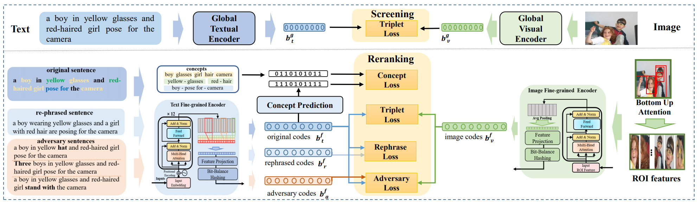

# Introduction
This is the source code of Efficient Fine-Grained Visual-Text Search Using Adversarially-Learned Hash Codes, IEEE ICME 2021.



This project is modified from the [SAEM repo](https://github.com/yiling2018/saem)


## Requirements
* python 3.6
* pytorch 0.4.1+

## Download data
For the roi feature, we use the precomputed image features provided by [SCAN](https://github.com/kuanghuei/SCAN). Please download data.zip from [SCAN](https://github.com/kuanghuei/SCAN).

For other data like rephrased sentences or adversarial samples as well as concept data which can be download from [here](https://drive.google.com/drive/folders/1cM2-vTbSaJoQR_EUvkmVVW9iXy_rvDy3?usp=sharing).

## Bert model
We use the bert code from [BERT-pytorch](https://github.com/huggingface/pytorch-transformers). Please following [here](https://github.com/huggingface/pytorch-transformers/blob/4fc9f9ef54e2ab250042c55b55a2e3c097858cb7/docs/source/converting_tensorflow_models.rst) to convert the Google bert model to a PyTorch save file.


## Adversarial & Rephrase data generation
If you need to generate more adversarial sampels,
follow the repo below:
```bash
https://github.com/ExplorerFreda/VSE-C
```

The code of generating rephrase data is in the `generate_rephrase` folder.

## Training
```bash
python train_screen.py  # train screen model
python train_reranking.py  # train reranking model
```

## Test
```bash
CUDA_VISIBLE_DEVICES=1 python test.py --model_name=screen_model --final_dims=256 --need_concept_label=0 --need_rephrase_data=0 --adversary_num=0 --resume=$CHECKPOINT --remark=$YOUR_REMARK
CUDA_VISIBLE_DEVICES=1 python test.py --model_name=rerank_model --final_dims=2048 --need_concept_label=0 --need_rephrase_data=0 --adversary_num=0 --resume=$CHECKPOINT --remark=$YOUR_REMARK

```

## Citation
If this code is useful for you, please cite our paper:
```citation
TBD
```
